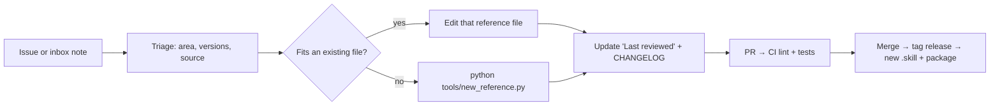

# Contributing

Thanks for helping the skill get better. The goal is simple: when someone asks an AI a Utility Network question, the answer should be as good as asking an experienced UN implementer — correct for their version, and honest about what it doesn't know.

## Ways to contribute

| You have… | Do this |
|---|---|
| A fact, gotcha, fix or doc page the skill should know | [Open an "Add UN knowledge" issue](https://github.com/sgdev279/esri-utility-network-skill/issues/new?template=add-knowledge.yml) — plain notes are fine |
| Spotted something wrong or outdated | [Open a correction](https://github.com/sgdev279/esri-utility-network-skill/issues/new?template=correction.yml) with a source link |
| Time to write it up yourself | Add or edit a reference file and open a PR (below) |
| Raw material (notes, exported docs, meeting notes) | Drop a markdown file in [`knowledge-inbox/`](knowledge-inbox) via PR |
| A bug in the MCP server or scripts | [Open a bug report](https://github.com/sgdev279/esri-utility-network-skill/issues/new?template=bug-report.yml) |

## How knowledge flows into the skill



## Writing or editing a reference file

**1. Find the right home.** Reference files live in `plugins/utility-network/skills/utility-network/references/<area>/`:

| Area | Covers |
|---|---|
| `pro-help/` | Concepts, configuration, administration, versions, licensing (Pro UI and GP tools) |
| `rest-api/` | UtilityNetworkServer, NetworkDiagramServer, versioning, validation, feature service |
| `js-api/` | ArcGIS Maps SDK for JavaScript |
| `pro-sdk/` | Pro SDK (C#) |
| `arcpy/` | Python in Pro |
| `experience-builder/` | Low-code apps |
| `github-ecosystem/` | Esri tools and repos |
| `mcp/` | AI agents and MCP |

Prefer editing an existing file. Create a new one only for a topic that would make an existing file sprawl.

**2. Scaffold a new file** (creates it in the house format and adds it to the index in `SKILL.md`):

```bash
python tools/new_reference.py --area pro-help \
  --title "Attribute rules with the utility network" \
  --read-when "Calculation/constraint rules on UN classes, rule order, performance" \
  --source https://doc.esri.com/...
```

**3. Follow the house style.**
- First line: `# Utility Network — <Topic> (Deep Reference)`
- Second line: `*Sources: <links>. Last reviewed: YYYY-MM-DD (Pro x.y / Enterprise x.y docs).*`
- Write facts **in your own words**. Short quotes of exact parameter names, field names and error text are fine; copied paragraphs are not.
- Give **exact names**: tools, parameters, fields, JSON keys, error codes. That precision is what makes the skill useful.
- Tie version-specific facts to a release ("added at Enterprise 11.3").
- Add a `## Gotchas` section for failure modes and a `## How to answer` section telling Claude how to use the file.
- Mark anything you couldn't verify as unverified rather than leaving it out or guessing.
- Keep files focused; if one passes ~400 lines, add a `## Contents` section or split it.

**4. Check your work.**
```bash
python tools/lint_references.py          # structure, sources, index, links
python tools/freshness_report.py         # refresh docs/FRESHNESS.md
python -m unittest discover -s tests     # scripts, validator, MCP server vs. mock service
```

**5. Update `CHANGELOG.md`** under an "Unreleased" heading, then open a PR. CI runs the linter, script self-tests and the package build.

## Changing SKILL.md

`SKILL.md` is loaded on every UN question, so keep it lean: workflow, routing, answer formats and the index. Detail belongs in reference files. If you change the description (the text that decides when the skill triggers), run the trigger checks in `evals/trigger_eval.json` with skill-creator before and after.

## Changing the MCP server

The server exists in two places that must stay identical:
`plugins/.../scripts/un_mcp_server.py` and `mcp-server/src/utility_network_mcp/server.py`. CI fails if they differ. Run `python mcp-server/src/utility_network_mcp/server.py --selftest` and keep write tools behind `UN_ALLOW_WRITES` plus `confirm=true`.

## Releases

Maintainers bump versions (`plugin.json` for the skill; `pyproject.toml` and `server.json` for the server), move "Unreleased" notes to a version heading in `CHANGELOG.md`, then create a release on GitHub (Releases → Draft a new release → new tag `vX.Y.Z` on `main` → Publish). The release workflow publishes the `.skill` file, the PyPI package and the MCP Registry entry.

## Ground rules

- No credentials, internal URLs, customer names or network data — anywhere, including issues.
- This is an independent project; don't present content as official Esri guidance.
- Be kind. See [CODE_OF_CONDUCT.md](CODE_OF_CONDUCT.md).
