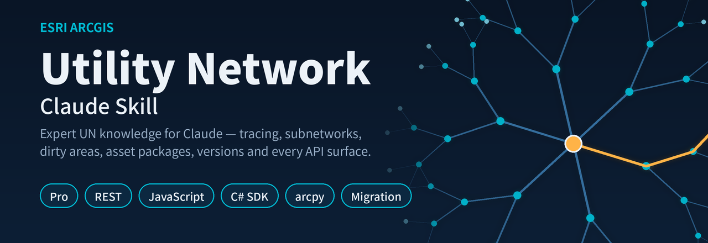
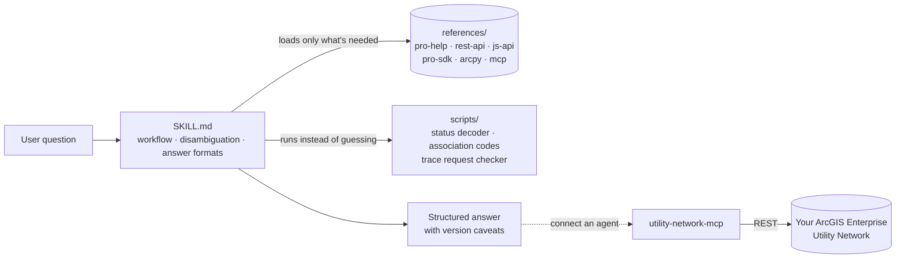

<p align="center">
  
</p>

<p align="center">
  <a href="https://github.com/sgdev279/esri-utility-network-skill/actions/workflows/ci.yml"></a>
  <a href="LICENSE"></a>
  
  
  
  
  <a href="CONTRIBUTING.md"></a>
</p>

<h3 align="center">Give Claude and other AI agents working knowledge of the Esri ArcGIS Utility Network.</h3>

---

Utility Network questions are hard for general-purpose AI: the answer depends on the dataset version, the deployment, which API you're in, and a long list of ordering rules and gotchas. This project packages that knowledge so an agent answers like an experienced UN implementer — and connects agents to a live network through MCP.

| | What it is | For |
|---|---|---|
| 🧠 **Skill** | 30+ curated reference files, answer templates, helper scripts and evals | Claude.ai, Claude Code, any agent that reads Agent Skills |
| 🔌 **MCP server** | `utility-network-mcp`: trace, subnetwork, dirty-area and association tools over the UtilityNetworkServer REST API | Claude Desktop, Claude Code, VS Code, Cursor and other MCP clients |

## See it in action

Real questions with the details a consultant would be given. Full walk-throughs with captured output are in [docs/EXAMPLES.md](docs/EXAMPLES.md).

**1. Apply Asset Package fails when adding gas to a water UN**
> Pro 3.5, Enterprise 11.3. `WaterUN` already has the `Water` domain network. Two maps open, connected as `gis_editor` (owner is `wateradmin`), portal login `jsmith`, version `wateradmin.crew1`, topology enabled for dispatch.

Finds **five** violated prerequisites at once (maps open, topology enabled, wrong database user, wrong portal user, not on DEFAULT), gives the fix order, and confirms that applying Gas does not wipe Water because the tool is additive.

**2. Isolation trace at the midpoint of main `{8F2A6C1E-...}` on branch `crew1.outage`**
> Stop at operable `Isolating` valves, domain `Water`, tier `Pressure`, someone else has the version open.

Produces a complete request (`percentAlong: 0.5`, `filterBarriers`, string values, no `sessionId`), and a validator checks it. On [a request with typical mistakes](examples/isolation-trace/request.broken.json) the validator reports seven problems, such as a percent along of 50, a start with no terminal or percent, and a misspelled `tierNam`.

**3. Dirty areas: Status 1 x 41,220, 9 x 312, 8 x 5, 40 x 18, and validate "succeeded"**

```console
$ python scripts/decode_dirty_status.py 9 8 40
9: feature inserted or updated; feature error  [edit + error]  ->  Validate will evaluate it. ...
8: feature error  [error only]  ->  Validate will IGNORE this row. ... fix it by EDITING the feature ...
40: feature error; subnetwork error  [error only]  ->  Validate will IGNORE this row. ... run Update Subnetwork ...
```

Rows 8 and 40 have no edit bit, so validate ignores them: edit the feature, then validate.

**4. Claude Desktop for 12 dispatchers on an electric UN (Enterprise 11.5, SAML)**
> "What is downstream of breaker CB-1042?" and "which feeders have dirty subnetworks?"

Recommends the custom REST MCP server (Esri's MCP beta has no utility network tools), turns "CB-1042" into a globalId with `find_features`, explains SAML-safe auth, and keeps dispatch read-only: write tools are not registered unless `UN_ALLOW_WRITES=true`, and each call needs `confirm=true`.

How these were tested, and where they fell short, is in [docs/TESTING.md](docs/TESTING.md).

## Quick start

**Claude Code**
```bash
claude plugin marketplace add sgdev279/esri-utility-network-skill
claude plugin install utility-network@esri-utility-network
```

**Claude.ai / Claude desktop app** — download `utility-network.skill` from the [latest release](https://github.com/sgdev279/esri-utility-network-skill/releases/latest) and add it to your skills.

**Any skills-aware agent** — copy [`plugins/utility-network/skills/utility-network`](plugins/utility-network/skills/utility-network) into its skills folder.

**MCP server** — see [`mcp-server/README.md`](mcp-server/README.md):
```bash
pip install utility-network-mcp
```

## What the skill knows

| Area | Coverage |
|---|---|
| **Core model** | Structure & domain networks, tiers (partitioned/hierarchical), subnetworks, terminals, asset groups/types, network attributes, categories, rules |
| **Operations** | Network topology, dirty areas & the Status bitmask, Error Inspector, Update/Export Subnetwork, branch versioning conflicts |
| **Tracing** | All trace types, traversability, filter barriers, functions, propagators, output filters — plus the full REST `traceConfiguration` schema |
| **Deployment** | UN Foundations & asset packages, dataset versions 4–8 with the Pro/Enterprise compatibility matrix, Upgrade Dataset, publishing, owners, licensing |
| **APIs** | REST (`UtilityNetworkServer`, `NetworkDiagramServer`, versioning, validation), ArcGIS Maps SDK for JavaScript, Pro SDK (C#), `arcpy.un`, Experience Builder |
| **AI agents** | Esri's MCP betas, GP-task tools, and a design guide + template for a UN MCP server |

Every answer follows a defined format (how-to, troubleshooting, code, MCP design, concept, cross-API translation), states which versions it applies to, and flags anything unverified.

## How it's built



The skill uses progressive disclosure: Claude reads the short `SKILL.md` first, then pulls in only the reference files a question needs, so broad coverage doesn't cost context on every question.

## Help improve it

The skill is designed to grow. You can contribute without writing code:

- **Share knowledge** — a gotcha you hit, a fix from Esri Community, a doc page the skill should know → [open an "Add UN knowledge" issue](https://github.com/sgdev279/esri-utility-network-skill/issues/new?template=add-knowledge.yml)
- **Report something wrong or outdated** → [open a correction](https://github.com/sgdev279/esri-utility-network-skill/issues/new?template=correction.yml)
- **Write a reference file** → `python tools/new_reference.py` scaffolds one in the house format; CI checks it

Details in [CONTRIBUTING.md](CONTRIBUTING.md). Planned content is tracked in the [roadmap](docs/ROADMAP.md), and content freshness in [docs/FRESHNESS.md](docs/FRESHNESS.md).

## Repository layout

```
plugins/utility-network/skills/utility-network/   the skill
  SKILL.md                                         entry point: workflow, routing, answer formats
  references/                                      topic files (pro-help, rest-api, js-api, pro-sdk, arcpy, mcp …)
  scripts/                                         helpers + MCP server template
  evals/                                           test prompts and trigger tests
mcp-server/                                        utility-network-mcp Python package
tools/                                             maintainer tools (scaffold, lint, freshness)
knowledge-inbox/                                   raw notes waiting to be turned into references
docs/                                              roadmap, freshness report, assets
.github/                                           CI, release, issue forms
```

## Disclaimer

Independent community project — **not affiliated with or endorsed by Esri**. ArcGIS and ArcGIS Utility Network are trademarks of Esri. Reference content is written in our own words from public Esri documentation; each file lists its sources and review date. Always confirm version-specific behaviour against Esri's documentation before production changes.

## Author

Built by **Sayanta Ghosh** ([@sgdev279](https://github.com/sgdev279)). If this helps your utility GIS work, a ⭐ helps others find it.

Licensed under the [MIT License](LICENSE).
