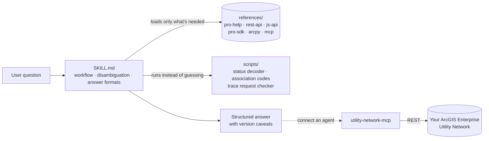

<p align="center">
  
</p>

<p align="center">
  <a href="https://github.com/sgdev279/esri-utility-network-skill/actions/workflows/ci.yml"></a>
  <a href="LICENSE"></a>
  
  
  
  
  <a href="CONTRIBUTING.md"></a>
</p>

<h3 align="center">Give Claude and other AI agents working knowledge of the Esri ArcGIS Utility Network.</h3>

---

Utility Network questions are hard for general-purpose AI: the answer depends on the dataset version, the deployment, which API you're in, and a long list of ordering rules and gotchas. This project packages that knowledge so an agent answers like an experienced UN implementer — and connects agents to a live network through MCP.

| | What it is | For |
|---|---|---|
| 🧠 **Skill** | 30+ curated reference files, answer templates, helper scripts and evals | Claude.ai, Claude Code, any agent that reads Agent Skills |
| 🔌 **MCP server** | `utility-network-mcp`: trace, subnetwork, dirty-area and association tools over the UtilityNetworkServer REST API | Claude Desktop, Claude Code, VS Code, Cursor and other MCP clients |

## See it in action

Ask the questions you'd ask a senior UN consultant:

> *"Apply Asset Package keeps failing when I add gas to our water UN. Pro 3.5, Enterprise 11.3."*
>
> → Troubleshooting answer walking the four prerequisites that cause most failures (maps closed, topology disabled, Pro/UN version match, both owners on DEFAULT), and why the tool is additive.

> *"Write the REST request for an isolation trace from this main at the midpoint, stopping at operable valves, on version crew1.outage."*
>
> → Complete request with `percentAlong`, filter barriers and `gdbVersion`, checked by a validator for the mistakes that make traces silently return nothing.

> *"Our dirty areas show Status 1, 9 and 40 — which ones matter?"*
>
> → Decoded bitmask: 1 is a pending edit, 9 and 40 carry feature and subnetwork errors, with the next action for each.

> *"Hook Claude up to our electric UN so dispatch can ask what's downstream of a breaker."*
>
> → Route recommendation (Esri's MCP beta vs. custom GP tools vs. this MCP server), tool list, auth, write-safety rails and licensing.

## Quick start

**Claude Code**
```bash
claude plugin marketplace add sgdev279/esri-utility-network-skill
claude plugin install utility-network@esri-utility-network
```

**Claude.ai / Claude desktop app** — download `utility-network.skill` from the [latest release](https://github.com/sgdev279/esri-utility-network-skill/releases/latest) and add it to your skills.

**Any skills-aware agent** — copy [`plugins/utility-network/skills/utility-network`](plugins/utility-network/skills/utility-network) into its skills folder.

**MCP server** — see [`mcp-server/README.md`](mcp-server/README.md):
```bash
pip install utility-network-mcp
```

## What the skill knows

| Area | Coverage |
|---|---|
| **Core model** | Structure & domain networks, tiers (partitioned/hierarchical), subnetworks, terminals, asset groups/types, network attributes, categories, rules |
| **Operations** | Network topology, dirty areas & the Status bitmask, Error Inspector, Update/Export Subnetwork, branch versioning conflicts |
| **Tracing** | All trace types, traversability, filter barriers, functions, propagators, output filters — plus the full REST `traceConfiguration` schema |
| **Deployment** | UN Foundations & asset packages, dataset versions 4–8 with the Pro/Enterprise compatibility matrix, Upgrade Dataset, publishing, owners, licensing |
| **APIs** | REST (`UtilityNetworkServer`, `NetworkDiagramServer`, versioning, validation), ArcGIS Maps SDK for JavaScript, Pro SDK (C#), `arcpy.un`, Experience Builder |
| **AI agents** | Esri's MCP betas, GP-task tools, and a design guide + template for a UN MCP server |

Every answer follows a defined format (how-to, troubleshooting, code, MCP design, concept, cross-API translation), states which versions it applies to, and flags anything unverified.

## How it's built



The skill uses progressive disclosure: Claude reads the short `SKILL.md` first, then pulls in only the reference files a question needs, so broad coverage doesn't cost context on every question.

## Help improve it

The skill is designed to grow. You can contribute without writing code:

- **Share knowledge** — a gotcha you hit, a fix from Esri Community, a doc page the skill should know → [open an "Add UN knowledge" issue](https://github.com/sgdev279/esri-utility-network-skill/issues/new?template=add-knowledge.yml)
- **Report something wrong or outdated** → [open a correction](https://github.com/sgdev279/esri-utility-network-skill/issues/new?template=correction.yml)
- **Write a reference file** → `python tools/new_reference.py` scaffolds one in the house format; CI checks it

Details in [CONTRIBUTING.md](CONTRIBUTING.md). Planned content is tracked in the [roadmap](docs/ROADMAP.md), and content freshness in [docs/FRESHNESS.md](docs/FRESHNESS.md).

## Repository layout

```
plugins/utility-network/skills/utility-network/   the skill
  SKILL.md                                         entry point: workflow, routing, answer formats
  references/                                      topic files (pro-help, rest-api, js-api, pro-sdk, arcpy, mcp …)
  scripts/                                         helpers + MCP server template
  evals/                                           test prompts and trigger tests
mcp-server/                                        utility-network-mcp Python package
tools/                                             maintainer tools (scaffold, lint, freshness)
knowledge-inbox/                                   raw notes waiting to be turned into references
docs/                                              roadmap, freshness report, assets
.github/                                           CI, release, issue forms
```

## Disclaimer

Independent community project — **not affiliated with or endorsed by Esri**. ArcGIS and ArcGIS Utility Network are trademarks of Esri. Reference content is written in our own words from public Esri documentation; each file lists its sources and review date. Always confirm version-specific behaviour against Esri's documentation before production changes.

## Author

Built by **Sayanta Ghosh** ([@sgdev279](https://github.com/sgdev279)). If this helps your utility GIS work, a ⭐ helps others find it.

Licensed under the [MIT License](LICENSE).
